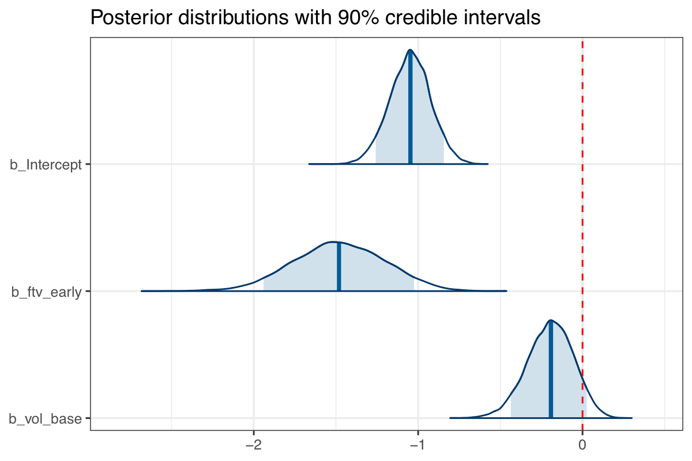
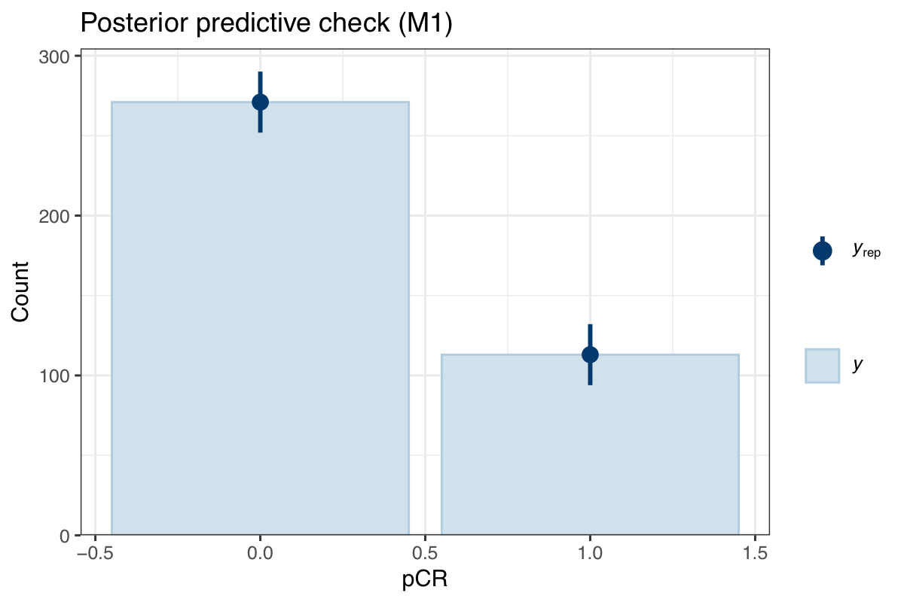
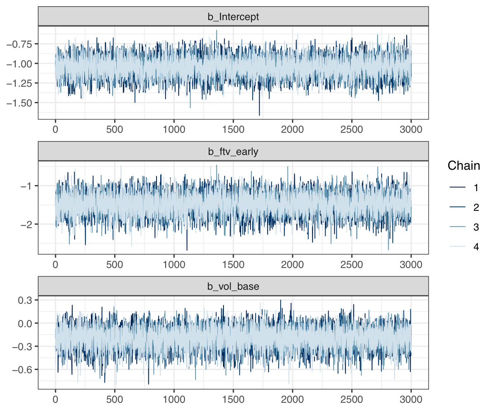
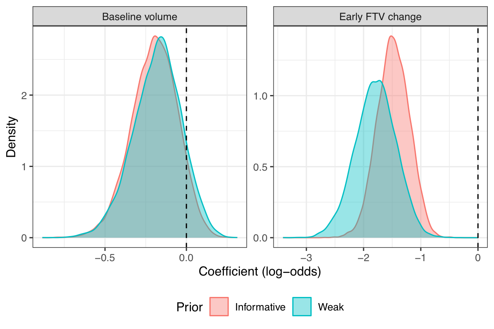

# I-SPY2 Bayesian Analysis: Early MRI Response and pCR Prediction

**Does early tumor shrinkage on MRI predict pathologic complete response (pCR) to neoadjuvant chemotherapy?**

This project applies Bayesian logistic regression to I-SPY2 trial data to evaluate whether early changes in functional tumor volume (FTV) measured by MRI can predict pCR — the gold standard marker of treatment success in breast cancer.

---

## Background

The [I-SPY2 trial](https://www.ispy2.org/) is an adaptive platform trial investigating neoadjuvant chemotherapy (NACT) in high-risk breast cancer. MRI is used at multiple timepoints to monitor tumor response. A key question is whether early imaging changes (before treatment completion) can identify which patients are on track to achieve pCR.

---

## Data

| File | Description |
|------|-------------|
| `data/ISPY2-Imaging-Cohort-1-Clinical-Data.xlsx` | Patient-level clinical outcomes including pCR status |
| `data/Multi-feature-MRI-NACT-Data.xlsx` | Multi-timepoint MRI tumor volume measurements |

**Key variables:**
- `FTV_pch_T0_T1` — % change in functional tumor volume from baseline (T0) to early on-treatment (T1). More negative = greater early shrinkage.
- `VOLUME_TUM_BLU_V10` — Baseline tumor volume at T0 (cm³)
- `pCR` — Binary outcome: pathologic complete response (1 = yes, 0 = no)

---

## Models

Two Bayesian logistic regression models were fit using `brms` (R interface to Stan):

### M1 — Primary model (early FTV change + baseline volume)

$$\text{logit}(P(\text{pCR}_i = 1)) = \beta_0 + \beta_1 \cdot \text{ftv\_early}_i + \beta_2 \cdot \text{vol\_base}_i$$

Informed priors based on published NACT evidence:

| Parameter | Prior | Rationale |
|-----------|-------|-----------|
| $\beta_0$ (Intercept) | $\mathcal{N}(0, 1.5)$ | Consistent with ~29% observed pCR rate |
| $\beta_1$ (Early FTV change) | $\mathcal{N}(-0.8, 0.5)$ | Early FTV reduction is an established pCR predictor |
| $\beta_2$ (Baseline volume) | $\mathcal{N}(-0.5, 0.5)$ | Larger tumors less likely to achieve pCR |

### M2 — Comparison model (baseline volume only)

Tests whether early FTV change adds predictive value beyond tumor size at baseline.

---

## Results

### Posterior Distributions (M1)



- **Early FTV change** ($\beta_1$): Clearly negative — greater early shrinkage strongly predicts pCR.
- **Baseline volume** ($\beta_2$): Negative but with more uncertainty.

### Posterior Predictive Check



Predicted pCR proportions closely match observed values, indicating good model calibration.

### MCMC Diagnostics



All $\hat{R} \approx 1$ and bulk ESS > 1,000 — chains converged and posterior estimates are reliable.

### Model Comparison (LOO-CV)

Leave-one-out cross-validation confirms M1 (with early FTV) outperforms M2 (baseline volume only), supporting the added predictive value of early imaging response.

### Sensitivity Analysis



Posteriors are nearly identical under informative vs. weakly informative priors — conclusions are robust to prior choice.

---

## Conclusions

- Greater early FTV reduction (T0 → T1) is associated with significantly higher odds of pCR, supporting early MRI as a useful imaging biomarker.
- Baseline tumor volume shows a negative association with pCR but with more uncertainty.
- LOO-CV confirms early FTV change improves prediction beyond baseline size alone.
- Results are stable across prior specifications.

---

## Repository Structure

```
.
├── data/
│   ├── ISPY2-Imaging-Cohort-1-Clinical-Data.xlsx
│   └── Multi-feature-MRI-NACT-Data.xlsx
├── output/
│   ├── m1.rds           # Fitted M1 model
│   ├── m1_weak.rds      # M1 with weak priors (sensitivity)
│   └── m2.rds           # Fitted M2 model
├── final_report_files/
│   └── figure-pdf/      # Generated figures
├── final_report.qmd     # Quarto source document
├── final_report.pdf     # Rendered report
└── final.pdf
```

---

## Dependencies

**R packages:** `brms`, `bayesplot`, `ggplot2`, `dplyr`, `tidyr`, `readxl`, `knitr`

Requires a Stan installation (via `cmdstanr` or `rstan`).

---

*DATASCI 226 Final Project — Shwetha Kandhalu — UCSF, March 2026*
